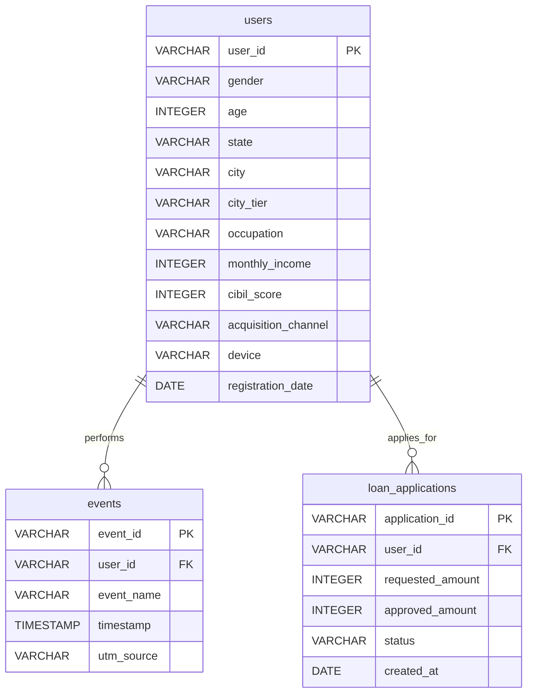

# Technical Specification: Users Dataset Design (InsightFlow)

## 1. Purpose of the Dataset
The `users` dataset serves as the core user profile dimension table (`dim_users`) in the InsightFlow analytics platform's data warehouse. It captures and stores user-level characteristics—demographic details, credit attributes, device characteristics, and acquisition channels—at the moment of registration (defined as mobile number OTP verification). 

This dataset serves as the analytical foundation for:
- Product and marketing teams to segment the registration-to-loan-disbursal funnel.
- Growth teams to measure Customer Acquisition Cost (CAC) and acquisition channel ROI.
- Risk and compliance teams to analyze demographic and geographic credit distributions.
- Data scientists to train propensity models and credit risk scorecards.

---

## 2. Table Metadata & Business Description
- **Table Name**: `users`
- **Logical Dimension Name**: `dim_users`
- **Primary Key**: `user_id`
- **Grain**: One row per unique verified user account.
- **Business Description**: This dimension table contains static and semi-static attributes of users who have signed up and verified their identity on the InsightFlow platform. It represents the "Who" in the customer journey and is the primary table against which transactional events (e.g., clicks, application submissions) are joined for cohort and segment analysis.

---

## 3. Complete Column List, Data Types & Business Meanings
The table contains 12 attributes. No null values are allowed in this core dimension to ensure robust downstream reporting and joins.

| Column Name | SQL Data Type | Key Type | Allow Nulls | Business Meaning / Description |
| :--- | :--- | :--- | :--- | :--- |
| `user_id` | `VARCHAR(32)` | Primary Key | No | A unique identifier generated upon successful mobile number OTP verification. Prefix format: `usr_` followed by a zero-padded 7-digit integer (e.g., `usr_0000001`). |
| `gender` | `VARCHAR(16)` | None | No | The self-reported gender of the user during onboarding. Permitted values: `Male`, `Female`, `Other`. |
| `age` | `INTEGER` | None | No | The current age of the user in years (calculated from date of birth). Must be between 18 and 65 inclusive, matching the eligible lending age criteria. |
| `state` | `VARCHAR(64)` | None | No | The Indian state of residence of the user, derived from verified Pincode or KYC documents. |
| `city` | `VARCHAR(64)` | None | No | The city of residence of the user. Must align geographically with the `state`. |
| `city_tier` | `VARCHAR(16)` | None | No | The Reserve Bank of India (RBI) tier classification of the city based on population and cost of living. Permitted values: `Tier 1`, `Tier 2`, `Tier 3`. |
| `occupation` | `VARCHAR(32)` | None | No | The primary employment status or livelihood category of the user. Permitted values: `Salaried`, `Self-Employed`, `Professional`, `Retired`, `Student`. |
| `monthly_income` | `INTEGER` | None | No | The verified net monthly income of the user in Indian Rupees (INR). For students, this may represent verified allowance/stipend or be 0. |
| `cibil_score` | `INTEGER` | None | No | The credit score retrieved from the Credit Information Bureau (India) Limited (CIBIL) at signup. Value ranges from `300` to `900`. If a user is New-to-Credit (NTC) and has no credit history, this value is set to `-1`. |
| `acquisition_channel` | `VARCHAR(32)` | None | No | The digital marketing channel or source through which the user was acquired. Permitted values: `Meta Ads`, `Google Ads`, `Affiliate`, `Referral`, `Organic`. |
| `device` | `VARCHAR(32)` | None | No | The hardware/operating system platform used by the user to register on InsightFlow. Permitted values: `Mobile-Android`, `Mobile-iOS`, `Desktop-Windows`, `Desktop-MacOS`. |
| `registration_date` | `DATE` | None | No | The date on which the user completed mobile OTP registration. Format: `YYYY-MM-DD`. |

---

## 4. Business Rules for Generating Realistic Data
To generate high-fidelity synthetic data that mimics a real-world Indian fintech user base and prevents downstream dashboard/model bias, we define specific probability distributions and correlations:

### Rule A: Geographic Mapping (Indian States, Cities, and Tiers)
Geography is restricted to a predefined list of Indian states and cities, ensuring that cities map correctly to their respective states and RBI city tiers.
*   **State-City-Tier Matrix**:
    - **Maharashtra**: Mumbai (Tier 1), Pune (Tier 1), Nagpur (Tier 2), Nashik (Tier 3)
    - **Karnataka**: Bangalore (Tier 1), Mysore (Tier 2), Hubli (Tier 3)
    - **Tamil Nadu**: Chennai (Tier 1), Coimbatore (Tier 2), Madurai (Tier 3)
    - **Delhi NCR**: New Delhi (Tier 1), Gurgaon (Tier 1), Noida (Tier 2)
    - **Telangana**: Hyderabad (Tier 1), Warangal (Tier 3)
    - **Uttar Pradesh**: Lucknow (Tier 2), Kanpur (Tier 2), Varanasi (Tier 3)
    - **Gujarat**: Ahmedabad (Tier 1), Surat (Tier 2), Rajkot (Tier 3)
    - **West Bengal**: Kolkata (Tier 1), Siliguri (Tier 3)
*   **Distribution Weights**:
    - Tier 1: 50% of the volume.
    - Tier 2: 30% of the volume.
    - Tier 3: 20% of the volume.

### Rule B: Occupation & Monthly Income Correlation
Income distributions follow log-normal distributions shaped by the user's occupation to avoid unrealistic combinations (e.g., student earning 5 Lakhs per month).
1.  **Salaried** (60% weight): Standard corporate employees. Income range: INR 18,000 to INR 250,000 (Median: INR 42,000).
2.  **Self-Employed** (20% weight): Business owners/traders. Income range: INR 15,000 to INR 400,000 (Median: INR 45,000, higher variance).
3.  **Professional** (10% weight): Doctors, Lawyers, CAs. Income range: INR 35,000 to INR 500,000 (Median: INR 80,000).
4.  **Retired** (5% weight): Pensioners. Income range: INR 12,000 to INR 80,000 (Median: INR 25,000).
5.  **Student** (5% weight): Pocket money/part-time. Income range: INR 0 to INR 15,000 (Median: INR 3,000).

### Rule C: Credit Score (CIBIL) Distributions & Correlations
A credit score of `-1` represents New-to-Credit (NTC) status, typical for younger demographics.
- **NTC Users** (15% overall weight): Assigned CIBIL `-1`. Highly correlated with `age` < 24 and occupation `Student` (80% probability).
- **Scored Users** (85% overall weight):
  - **Subprime** (300–600): 15% probability. High credit risk.
  - **Near-prime** (601–700): 25% probability. Moderate risk.
  - **Prime** (701–799): 45% probability. Target credit segment.
  - **Super-prime** (800–900): 15% probability. Ultra-low risk.
- *Correlation*: Age and income are positively correlated with CIBIL score.

### Rule D: Device Class & Income Correlation
Mobile registration dominates in India (~95%), with premium OS categories skews toward high earners.
- **High-Income Segment** (Monthly Income &ge; INR 150,000):
  - 45% `Mobile-iOS`, 35% `Mobile-Android`, 15% `Desktop-MacOS`, 5% `Desktop-Windows`.
- **Low-to-Mid Income Segment** (Monthly Income < INR 40,000):
  - 95% `Mobile-Android`, 4% `Mobile-iOS`, 1% `Desktop-Windows`.
- **Standard Segment** (All other incomes):
  - 85% `Mobile-Android`, 10% `Mobile-iOS`, 4% `Desktop-Windows`, 1% `Desktop-MacOS`.

### Rule E: Acquisition Channel Skew
Acquisition channels have demographic and risk profiles:
- **Google Ads** (30% weight): High intent, skews towards average-to-high incomes and prime CIBIL scores.
- **Meta Ads** (35% weight): High engagement, skews younger (18-30), higher percentage of students and Android users.
- **Affiliate** (20% weight): Performance networks. Skews subprime as users with low credit profiles actively hunt for credit alternatives.
- **Referral** (10% weight): High conversion, balanced distributions across all classes.
- **Organic** (5% weight): Most loyal; high credit score profiles.

### Rule F: Registration Date Seasonal Trend
- **Temporal Range**: 2025-07-01 to 2026-06-30 (1 year of data).
- **Platform Growth**: Simulate an expansion curve using a compounding 6% month-on-month growth rate.
- **Weekly Cycle**: High signup volumes during weekdays (Monday–Friday) and a 30% volume drop-off during weekends (Saturday–Sunday).

---

## 5. Downstream Database Relationships
The `users` table functions as the central dimension table in our star schema. It relates directly to transactional tables planned for future sprints.



---

## 6. Data Validation Constraints (QA Rules)
To guarantee data quality before downstream processing, the generated dataset must pass the following assertions:

1.  **Entity Integrity**: `user_id` must be the primary key (unique and non-null across all rows).
2.  **Referential Domain Boundaries**:
    - $18 \le \text{age} \le 65$.
    - $\text{monthly\_income} \ge 0$.
    - $\text{cibil\_score} \in [300, 900] \cup \{-1\}$.
    - `gender` must be in `['Male', 'Female', 'Other']`.
    - `city_tier` must be in `['Tier 1', 'Tier 2', 'Tier 3']`.
    - `acquisition_channel` must be in `['Meta Ads', 'Google Ads', 'Affiliate', 'Referral', 'Organic']`.
    - `device` must be in `['Mobile-Android', 'Mobile-iOS', 'Desktop-Windows', 'Desktop-MacOS']`.
3.  **Logical Consistency Checks**:
    - **Geographic alignment**: If `city` = 'Bangalore', `state` must be 'Karnataka' and `city_tier` must be 'Tier 1'.
    - **Income limits**: If `occupation` = 'Student', then `monthly_income` &le; INR 25,000.
    - **NTC score eligibility**: If `age` < 21, the probability of `cibil_score` being `-1` should be high (~80%), reflecting young borrowers without history.
    - **Temporal alignment**: All `registration_date` records must fall strictly within the interval `[2025-07-01, 2026-06-30]`.

---

## 7. Example Records
```json
[
  {
    "user_id": "usr_0000001",
    "gender": "Male",
    "age": 28,
    "state": "Karnataka",
    "city": "Bangalore",
    "city_tier": "Tier 1",
    "occupation": "Salaried",
    "monthly_income": 48000,
    "cibil_score": 745,
    "acquisition_channel": "Google Ads",
    "device": "Mobile-Android",
    "registration_date": "2025-07-02"
  },
  {
    "user_id": "usr_0000002",
    "gender": "Female",
    "age": 21,
    "state": "Maharashtra",
    "city": "Nashik",
    "city_tier": "Tier 3",
    "occupation": "Student",
    "monthly_income": 2000,
    "cibil_score": -1,
    "acquisition_channel": "Meta Ads",
    "device": "Mobile-Android",
    "registration_date": "2025-07-03"
  },
  {
    "user_id": "usr_0000003",
    "gender": "Female",
    "age": 42,
    "state": "Gujarat",
    "city": "Ahmedabad",
    "city_tier": "Tier 1",
    "occupation": "Professional",
    "monthly_income": 180000,
    "cibil_score": 810,
    "acquisition_channel": "Organic",
    "device": "Mobile-iOS",
    "registration_date": "2025-07-04"
  }
]
```
